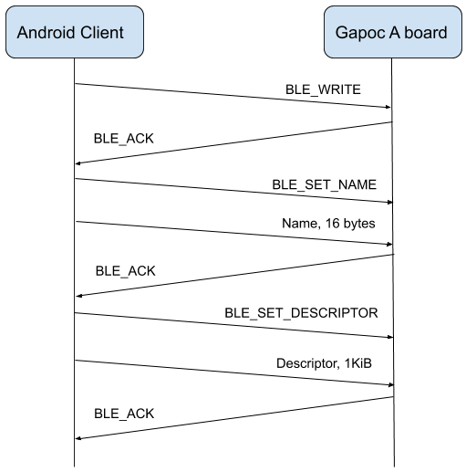

# Overview

Gapoc A board includes Bluetooth LE module that makes possible smart door bell management with Android-based smartphone remotely. During regular re-id loop thew demo stores all strangers descriptor and photo in L2 and L3 memory accordingly. On button press the board is switched to strangers management mode and activates Bluetooth module for smart phone connection. Strangers management consists of three phases: strangers information download to phone, users management on phone and approved users upload back to device memory. Strangers download to phone and further upload to the device is covered in dedicated sections bellow. At the end of strangers administration step all strangers are dropped from L2 and L3 memory as all known people has been already added to list of users.

# Strangers Download to Android App

# Known Users Database Update

# Known Issues and Hardware Limitations

1. Due to hardware bug in GAP8 chip Hyperram and UART cannot be used in the same time. Demo downloads strangers photos to L2 memory and switch `HYPERBUS_DATA6_PAD` mode to UART mode before Bluetooth module enabling and back after the disconnection.

2. GAP8 chip does not support hardware flow control and interacts with Ublocks NINA BLE module using DMA ignoring it's state. Maximum DMA transfer size is 1 KiB. In case if sent or received buffer is larger than maximum transfer size several DMA calls are done without BLE module await that leads to data corruption. The demo splits face photo buffer on 1Kib chunks to work around the issue.

3. UART transactions are not buffered and should not be mixed with high latency operations, including `printf` call for logging to console.
